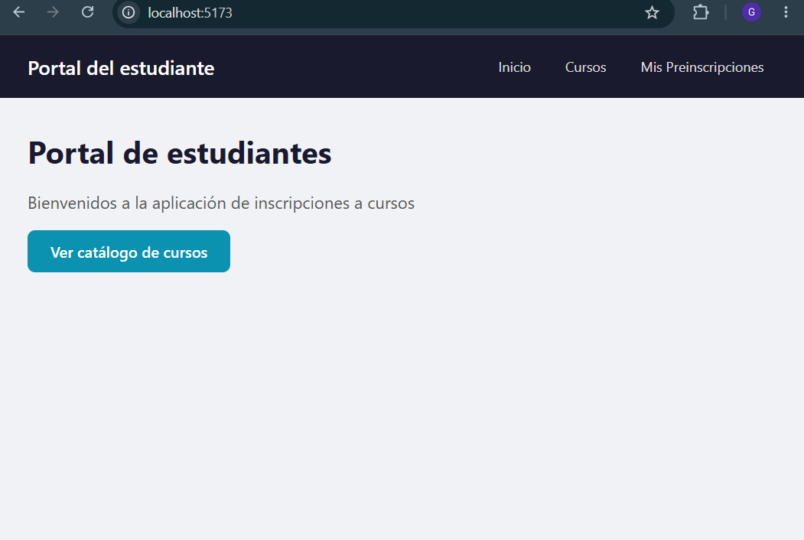
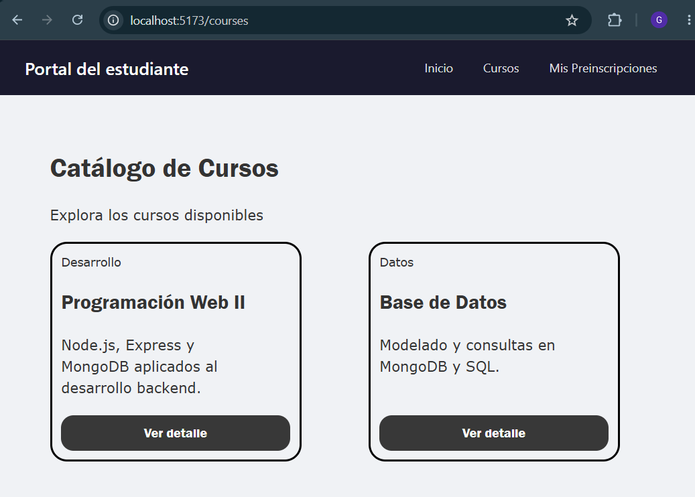
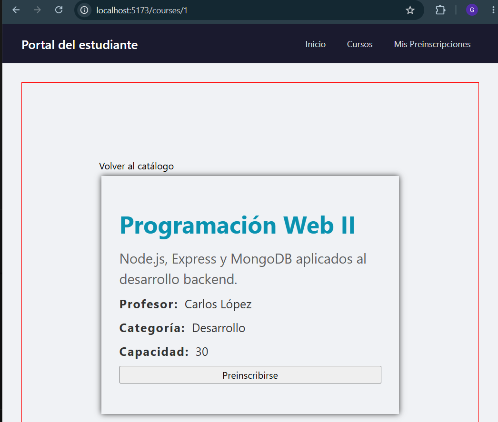
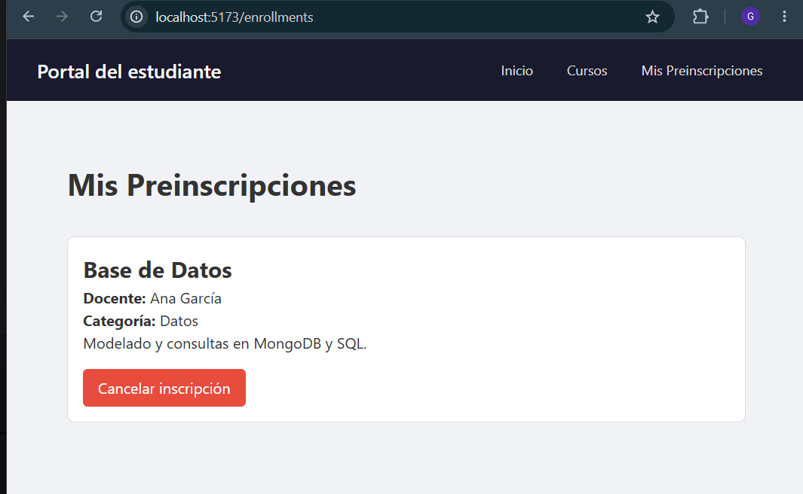
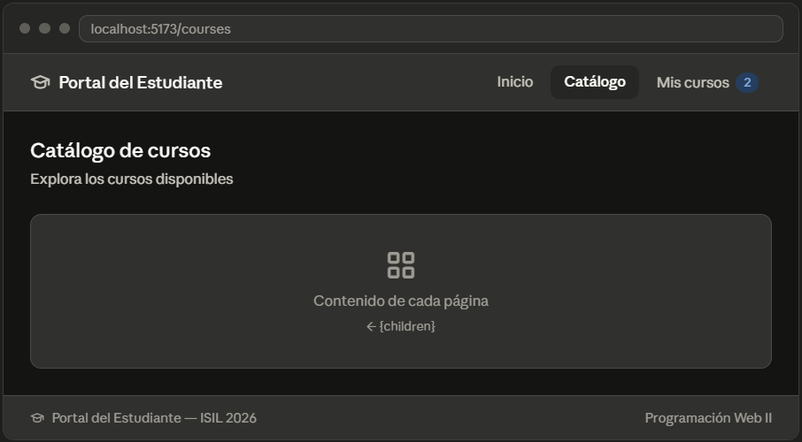
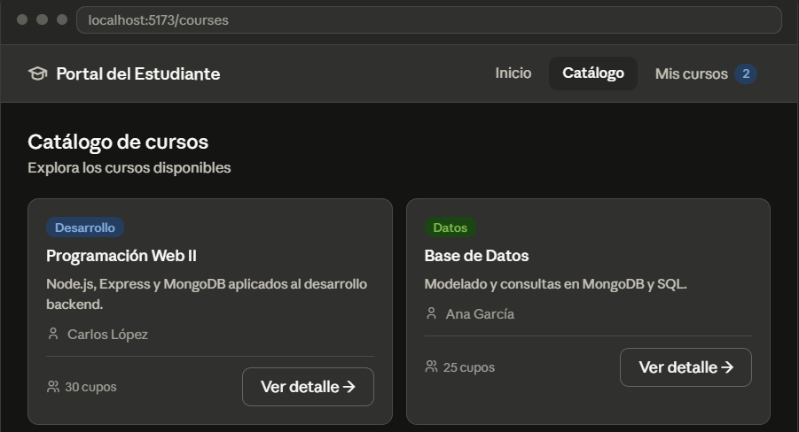
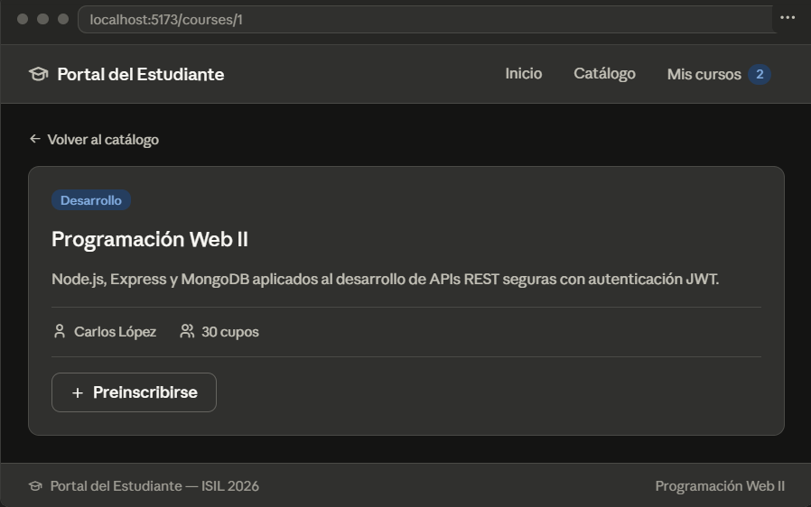
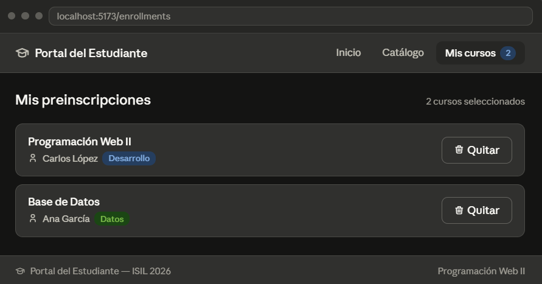

#  Gestión de Cursos - Portal de estudiante

Aplicación frontend para el sistema de Gestión de Cursos e Inscripciones, desarrollada con React y React Router.

### Integrantes

| Nombre | Email |
|--------|-------|
| Gustavo Arturo Ugarte Torres  | 75399166@mail.isil.pe  |
| Diego Alonso Josue García Díaz| 71158945@mail.isil.pe  |
| Jaidy Julisa Rojas Ciriaco    | 77681482@mail.isil.pe  |
| Aldair Casafranca             | 74908088@mail.isil.pe  |
| Frank Anthony Espino Delerna  | 74176103@mail.isil.pe  |

### Enlace youtube

> Agrega aquí el enlace al video de sustentación en YouTube.

## Imágenes de funcionamiento

### 1- Inicio


### 2- Catálogo de cursos


### 3- Detalle de curso


### 4- Mis preinscripciones


##  Cómo empezar (todos los integrantes)

### 1. Clonar el repositorio

Abre tu terminal, ve a la carpeta donde quieres guardar el proyecto y ejecuta:

```bash
git clone https://github.com/GustavoUT22/courses-management-frontend-react-isil.git
```
Ingresa al directorio del proyecto clonado.
```bash
cd courses-management-frontend-react-isil
```

### 2. Instalar dependencias

```bash
pnpm install
```

> Esto descarga todo lo necesario para que el proyecto funcione. Solo se hace una vez.

### 3. Correr el proyecto

```bash
pnpm run dev
```

Abre tu navegador en `http://localhost:5173` y deberías ver la app corriendo.

---

## Flujo de trabajo con Git

Cada integrante trabaja en su propia rama. **Nunca trabajes directo en `main`.**

### Crear tu rama

```bash
# Primero asegúrate de estar en main y tener lo último
git checkout main
git pull

# Crear y cambiar a tu rama (reemplaza el nombre según tu issue)
git checkout -b feature/nombre-de-tu-rama
```

### Guardar tu trabajo

```bash
# Ver qué archivos cambiaste
git status

# Agregar todos los cambios
git add .

# Guardar con un mensaje descriptivo
git commit -m "feat: descripción de lo que hiciste"

# Subir tu rama a GitHub
git push origin feature/nombre-de-tu-rama
```

### Mantener tu rama actualizada

Si alguien más hizo cambios en `main` mientras trabajabas:

```bash
git checkout main
git pull
git checkout feature/nombre-de-tu-rama
git merge main
```

### Cuando termines

1. Sube tus cambios: `git push origin feature/nombre-de-tu-rama`
2. Ve a GitHub y crea un **Pull Request** hacia `main`
3. Avisa al líder del grupo para que lo revise y apruebe

---

## Estructura del proyecto

```
src/
├── components/       ← componentes reutilizables
├── pages/            ← vistas principales
├── routes/           ← configuración de rutas (si aplica)
├── context/          ← Context API para estado global
├── store/            
├── data/             ← datos mock de cursos / datos simulados :v
├── hooks/            ← hooks personalizados
├── utils/            ← funciones, constantes, etc.
└── App.jsx           ← componente raíz con rutas configuradas
```

> Crea tus archivos en la carpeta que corresponde según tu issue.

---

## Rutas de la aplicación

| Ruta | Página | Descripción |
|---|---|---|
| `/` | Home | Página de inicio |
| `/courses` | CoursesPage | Catálogo de cursos |
| `/courses/:id` | CourseDetailPage | Detalle de un curso |
| `/enrollments` | EnrollmentsPage | Mis preinscripciones |
 
## Integrantes y ramas

| Integrante | Nombre | Email | Issue | Rama |
|---|---|---|---|---|
| Integrante 1 | Gustavo | gustavougartetorres@gmail.com | Setup base | `main` |
| Integrante 2 |  |  | Navbar y Layout | `feature/navbar-layout` |
| Integrante 3 |  |  | Catálogo de cursos | `feature/courses-catalog` |
| Integrante 4 |  |  | Detalle de curso | `feature/course-detail` |
| Integrante 5 |  |  | Mis preinscripciones | `feature/enrollments-page` |

---

## Vistas de la aplicación
> Las imágenes son referenciales, solo úsenalas como guía visual. No es necesario replicarlas exactamente, ya que solo es estructura.

### 1- Navbar y Layout
- El layout es el header y el footer
- Navbar está dentro del header



### 2- Catálogo de cursos


### 3- Detalle de curso


### 4- Mis preinscripciones



## Capturas requeridas

| Vista | Ruta | Captura |
|---|---|---|
| Home | `/` |  |
| Catálogo de cursos | `/courses` |  |
| Detalle de curso | `/courses/:id` |  |
| Mis preinscripciones | `/enrollments` |  |

> Reemplaza los enlaces vacíos con las capturas reales de la aplicación corriendo.

---

## Entregables
- [ ] Repositorio en GitHub con todas las ramas mergeadas a `main`
- [ ] App corriendo sin errores críticos
- [ ] Capturas de pantalla de las vistas principales
- [ ] Video de sustentación en YouTube (8-10 min, cámaras prendidas)
- [ ] Matriz de participación completada